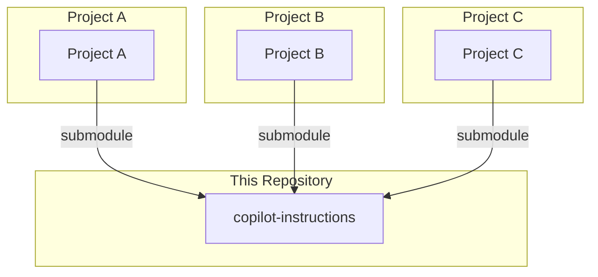

# Copilot Instructins
my instructions files.

## Initialize

```bash
cd your-project
git submodule add https://github.com/i7s7-ymp/copilot-instructions.git .github/instructions

cd your-project/.github/instructions
git fetch --tags
git tag
git checkout tags/<tag_name>
```

## Architecture

